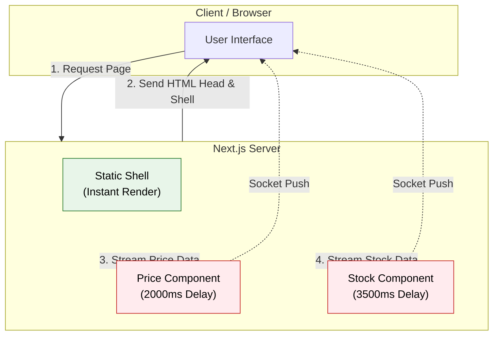

# ⚡ Next.js Hybrid Cache Lab: Static Shell + Dynamic Holes

Bu proje, Next.js (App Router) kullanarak **"Partial Prerendering" (PPR)** mimarisini simüle eden ve **"Streaming SSR"** yeteneklerini uç sınırlarda test eden bir laboratuvar çalışmasıdır.

## Projenin Amacı

Modern web uygulamalarında "Veri Güncelliği" (Freshness) ile "Yükleme Hızı" (Performance) genellikle birbiriyle çelişir. Bu projede şu mimariyi uyguladık:

1.  **Static Shell (Anında Yükleme):** Sayfanın iskeleti, başlığı ve layout'u sunucudan milisaniyeler içinde gelir.
2.  **Dynamic Holes (Streaming):** Fiyat ve Stok gibi ağır veriler, sayfa yüklendikten sonra açık HTTP bağlantısı üzerinden "akar" (Stream).
3.  **Visual Feedback Control:** Next.js'in "Soft Navigation" davranışını manipüle ederek, kullanıcıya her güncellemede Loading Skeleton'ları göstermeyi zorunlu kıldık.

## Mimari Yaklaşım

Sayfa iki ana katmandan oluşur:

- **Static Shell:** `fakeDb`'den senkron veri çeker. Bloklamaz. Anında render olur.
- **Dynamic Holes:** `api.ts` içindeki yapay gecikmeli (2s - 3.5s) servisleri bekler. `Suspense` ile sarmalanmıştır.

### Mimari Diyagramı

